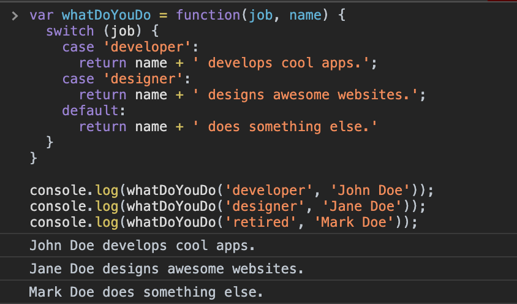

[`Programación con JavaScript`](../../Readme.md) > [`Sesión 03`](../Readme.md) > `Ejemplo 02`

---

## Ejemplo 2: Expresión de Función

### Objetivo

Analizar la diferencia entre declaración de función y expresión de función.

#### Requisitos

En una nueva carpeta vamos a crear un archivo `HTML` en blanco llamado `index.html`:

```html
<html>
  <head>
    <script type="text/javascript" src="./ejemplos-sesion-3.js"></script>
  </head>
</html>
```

Dentro de la misma carpeta creamos un archivo `ejemplos-sesion-3.js` que es donde se trabajarán los ejemplos de esta sesión. Finalmente abre el archivo `index.html` en Chrome e inspecciona la consola para ver los resultados.


#### Desarrollo

Ya vimos cómo en las declaraciones de funciones comenzamos con `function` después el nombre y los argumentos de la función dentro de paréntesis.

```javascript
function whatDoYouDo(job, name) {
  ...
}
```

La sintaxis cambia un poco en una expresión de función.

```javascript
var whatDoYouDo = function(job, name) {
  switch (job) {
    case 'developer':
      return name + ' develops cool apps.';
    case 'designer':
      return name + ' designs awesome websites.';
    default:
      return name + ' does something else.'
  }
}

console.log(whatDoYouDo('developer', 'John Doe'));
console.log(whatDoYouDo('designer', 'Jane Doe'));
console.log(whatDoYouDo('retired', 'Mark Doe'));
```
> No es necesario incluir `break` en cada caso del `switch` porque `return` finaliza la función, el siguiente código no es ejecutado.


