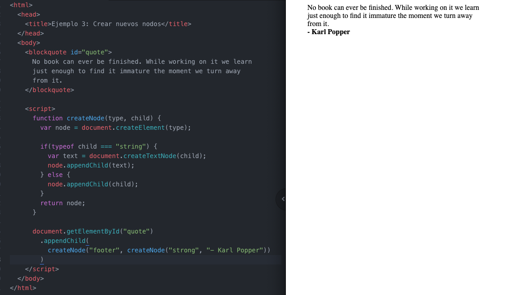

[`Programación con JavaScript`](../../Readme.md) > [`Sesión 07`](../Readme.md) > `Ejemplo 03`

---

## Ejemplo 3: Crear nuevos nodos

### Objetivo

Crear nuevos nodos para manipular la estructura del DOM.

#### Requisitos

En una nueva carpeta vamos a crear un archivo `HTML` en blanco llamado `index.html`:

```html
<html>
  <head>
    <title>Ejemplo 3: Crear nuevos nodos</title>
  </head>
  <body>
    <blockquote id="quote">
      No book can ever be finished. While working on it we learn
      just enough to find it immature the moment we turn away
      from it.
    </blockquote>

    <script>
      // Code goes here
    </script>
  </body>
</html>
```

Opcionalmente se puede manejar el código de JavaScript en un archivo independiente como se ha trabajado en sesiones anteriores.

#### Desarrollo

Obtener un nuevo nodo normalmente consta de tres pasos, el primero es crear el nodo en sí con `document.createElement`, el segundo paso es crear otro nodo de texto con `document.createTextNode`, el último paso es agregar el texto como hijo del nodo creado en el primero paso.

En este ejemplo vamos a crear una función que se encargue de estos tres pasos, la función recibirá dos argumentos, el primero será el tipo de nodo que queremos, y el segundo el hijo. Usaremos esta función para agregar el autor de la frase que ya tenemos en nuestro documento.

```javascript
function createNode(type, child) {
  var node = document.createElement(type);
  var text = document.createTextNode(child);

  node.appendChild(text);

  return node;
}

console.log(createNode('h1', 'Hello World')); // <h1>Hello World</h1>
```

Hasta ahora está bien, pero podemos extender aún más la funcionalidad de esta función, el segundo parámetro no necesaiamente debe ser un string, también podría ser un nodo. De esta forma podríamos anidar nodos con la misma función.

```javascript
function createNode(type, child) {
  var node = document.createElement(type);

  if(typeof child === "string") {
    var text = document.createTextNode(child);
    node.appendChild(text);
  } else {
    node.appendChild(child);
  }

  return node;
}

console.log(createNode('h1', createNode('strong', 'Hello World')));
/**
* <h1>
*  <strong>Hello World</strong>
* </h1>
**/
```

Con esta función es ahora más fácil crear nodos con sus respectivos hijos. Ahora podemos seleccionar el nodo que contiene la frase célebre con su respectivo id y agregar el autor.

```javascript
document.getElementById("quote")
  .appendChild(
    createNode("footer", createNode("strong", "- Karl Popper"))
  )
```
> Se puede escribir en una sola línea. Es buena práctica agregar los saltos de línea y la indentación para facilitar la lectura.


